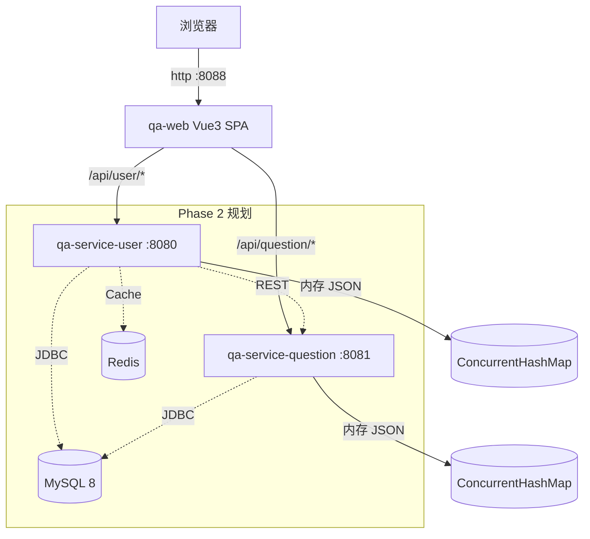

# 系统架构（L2 层）

## 概述

QA Healthcare 采用**微服务架构**，基于 Spring Boot 3.5.7，按业务领域（用户、问题、统计）拆分为独立服务，遵循领域驱动设计（DDD）与经典分层架构。当前处于 **Phase 1**：后端以内存 JSON 存储，前端独立 SPA。

## 架构总览（Mermaid）



## 服务清单（实际代码状态）

| 服务 | 端口 | 职责 | 状态 |
|------|------|------|------|
| qa-service-user | 8080 | 用户/医生管理、CORS、认证（规划） | ✅ 已实现（TestController + DoctorUserController，内存数据） |
| qa-service-question | 8081 | 问题/问答流程 | 🔲 基础框架（业务 API 待开发） |
| qa-service-statistic | 8082 | 数据统计/报表 | 🔲 占位目录 |

## 分层架构

每个微服务内部采用经典分层，单向依赖：

```
Controller → Service → Repository → Entity
   │            │            │            │
 参数校验     业务逻辑       CRUD        JPA 映射
 响应组装     事务管理       查询规格     关联关系
```

- **Controller**：`@RestController`，接收请求、参数校验、统一响应包装。
- **Service / impl**：业务逻辑、`@Transactional`、Entity↔DTO 转换。
- **Repository**：`extends JpaRepository<X, ID>` + `JpaSpecificationExecutor`。
- **Entity**：`@Entity`/`@Table`，当前由内存 JSON 加载，未来映射 MySQL 表。

## 服务间通信

- **当前**：同步 HTTP REST（如问答流程中 question 服务调用 user 服务校验医生/患者）。
- **未来**：RabbitMQ/Kafka 异步事件（UserRegisteredEvent、QuestionSubmittedEvent 等）。

## 数据流（患者提问）

1. 患者认证 → `POST /api/patients/verify`（user 服务，生成 token）
2. 提交问题 → `POST /api/questions`（question 服务，携带 token）
3. 医生查看 → `GET /api/questions?doctorId=&status=pending`
4. 医生回复 → `POST /api/questions/{id}/answer`，并推送统计事件

## 安全架构

| 层 | 状态 |
|----|------|
| 网络安全（HTTPS/防火墙） | 规划 |
| 应用安全 — CORS | ✅ 已实现 |
| 应用安全 — 参数校验/SQL 注入/XSS | 🔲 待完善（JPA 参数化查询内置防护） |
| 认证授权 — JWT / OAuth2 / RBAC | 🔲 待实现（Spring Security + jjwt） |
| 数据安全 — BCrypt / 脱敏 / 备份 | 🔲 待实现 |

## 技术选型

| 层面 | 技术 | 版本 |
|------|------|------|
| JDK | OpenJDK Temurin | 17 |
| 后端框架 | Spring Boot | 3.5.7 |
| Web | Spring Web MVC | 6.x |
| ORM | Spring Data JPA | 3.x |
| 监控 | Spring Boot Actuator | 3.x |
| 前端框架/语言/构建 | Vue 3 + TypeScript + Vite + Ant Design Vue | 3.5 / 5.5 / 5.4 / 4.2 |
| 前端 HTTP 客户端 | axios | ^1.13.6 |
| 前端国际化 | vue-i18n | ^9.14.4 |
| 前端日期处理 | dayjs | ^1.11.19 |
| 前端路由 | vue-router | ^4.6.3 |
| 构建/编排 | Maven / concurrently / Docker Compose | — |

**演进路线**：Phase 1 基础框架（REST + JSON）→ Phase 2 持久化（MySQL + Redis）→ Phase 3 高可用（K8s + 网关 + 消息队列）→ Phase 4 云原生（服务网格）。

## 部署架构

- **开发**：根 `package.json` 并发起前端(:5173)+后端(:8080/:8081)，JSON 内存数据。
- **Docker**：`docker-compose.yml` 编排 MySQL(:3307)+phpMyAdmin(:6080)+user(:18080)+question(:18081)+web(:8088)，前端 Nginx 反代。
- **未来**：Kubernetes（Ingress + Service/Pod + HPA + MySQL/Redis StatefulSet）。

## 可观测性

- **Actuator**：`/actuator/health|info|metrics|env|beans|loggers`（K8s 探针用 health）。
- **未来**：Micrometer + Prometheus + Grafana（JVM/HTTP/业务指标）。

## 扩展性

- 无状态服务设计，支持水平扩展（多实例共享 DB/缓存）。
- 配置外置（profile + 环境变量），数据分离（服务只处理业务）。

---

*由 QA Healthcare 上下文构建工具集维护。*
