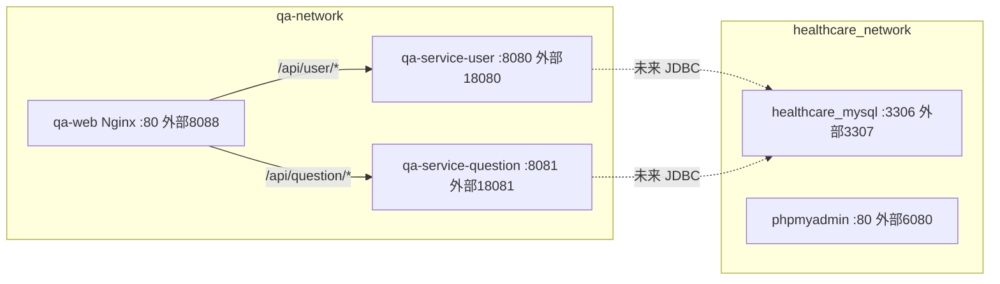

# 部署配置（L2 层）

## 概述

QA Healthcare 提供两种运行方式：**本地开发**（根 `package.json` + `concurrently` 并发起前后端）与 **Docker Compose 一体化编排**（MySQL + 后端双服务 + 前端 Nginx）。生产推荐 Docker / Kubernetes（见 `server/docs/deployment.md`）。

## Docker Compose 部署架构

`docker-compose.yml` 定义 5 个服务，分属 `qa-network` 与 `healthcare_network`：



## 服务端口映射

| 服务 | 容器端口 | 宿主机端口 | 访问地址 |
|------|----------|------------|----------|
| healthcare_mysql | 3306 | 3307 | `mysql://localhost:3307/healthcare` |
| healthcare_phpmyadmin | 80 | 6080 | http://localhost:6080 |
| qa-service-user | 8080 | 18080 | http://localhost:18080 |
| qa-service-question | 8081 | 18081 | http://localhost:18081 |
| qa-web | 80 | 8088 | http://localhost:8088 |

MySQL 凭据：`root/root`，库 `healthcare`，用户 `user/password`，字符集 utf8mb4。

## 关键配置

**后端服务（qa-service-user / qa-service-question）**
```yaml
environment:
  - SPRING_PROFILES_ACTIVE=prod
  - SERVER_PORT=8080   # / 8081
healthcheck:
  test: ["CMD", "curl", "-f", "http://localhost:8080/actuator/health"]
  interval: 30s
  timeout: 10s
  retries: 3
  start_period: 60s
restart: unless-stopped
```

**前端（qa-web）**：`depends_on` 后端 `service_healthy` 后启动；Nginx 反向代理 `/api/user/*` → user、`/api/question/*` → question。

## 镜像构建

后端 `Dockerfile`（多阶段）：`maven:3.9-eclipse-temurin-17` 构建 → `eclipse-temurin:17-jre` 运行，内置 `/actuator/health` 健康检查。前端 `web/qa-web/Dockerfile`：Node 构建 → Nginx 托管 `dist/`。

```bash
docker-compose up -d            # 启动全部
docker-compose ps               # 状态
docker-compose logs -f         # 日志
docker-compose down -v         # 停止并删卷
```

## 本地开发部署

```bash
npm install && npm run install:all   # 安装依赖
npm run dev                          # 并发起 web(:5173)+user(:8080)+question(:8081)
```

## 环境配置

| 变量 | 默认值 | 说明 |
|------|--------|------|
| `SPRING_PROFILES_ACTIVE` | default | dev / test / prod |
| `SERVER_PORT` | 8080 | 服务端口 |
| `LOG_LEVEL` | INFO | 日志级别 |

配置文件：`src/main/resources/application.yml`（默认）+ `application-{dev,test,prod}.yml`。

## 健康检查与监控

| 端点 | 说明 |
|------|------|
| `/actuator/health` | 健康检查（容器探针） |
| `/actuator/info` | 应用信息 |
| `/actuator/metrics` | 指标 |
| `/actuator/env` | 环境配置 |

## 故障排查

- **端口冲突**：修改 `docker-compose.yml` 宿主机映射端口。
- **健康失败**：后端冷启动长，调大 `start_period`（默认 60s）。
- **日志**：`docker logs -f qa-service-user`；容器排查 `docker exec -it qa-service-user /bin/bash`。

---

*由 QA Healthcare 上下文构建工具集维护。*
