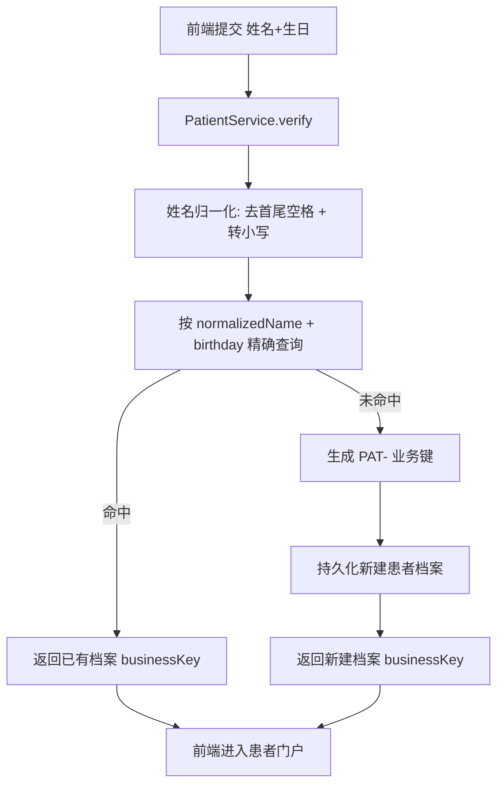

# FT-001 患者身份验证与自动建档 — PRD 产品需求文档

> **🔗 前置依赖**：本文档基于 [FT-001-patient-identity-verification-AskMe.md](./FT-001-patient-identity-verification-AskMe.md)（需求访谈文档）编写。

> 最后更新：2026-07-14

---

## 修订记录

| 版本 | 日期 | 修订人 | 修订内容 |
| ------ | ------ | -------- | ---------- |
| 1.0.0 | 2026-07-14 | AI Agent | 初始版本 |
| 1.1.0 | 2026-07-14 | AI Agent | 阶段二详细设计补充（技术方案/数据模型/接口设计/依赖关系/风险与缓解/验收条件 DoD） |

---

## 目录

- [1. 总体概述](#1-总体概述)
- [2. 使用场景](#2-使用场景)
- [3. 技术方案](#3-技术方案)
  - [3.1 患者验证与建档流程](#31-患者验证与建档流程)
  - [3.2 业务键生成规则](#32-业务键生成规则)
  - [3.3 姓名归一化与匹配规则](#33-姓名归一化与匹配规则)
- [4. 数据模型](#4-数据模型)
  - [4.1 patient 患者档案表](#41-patient-患者档案表)
  - [4.2 question 问诊记录表](#42-question-问诊记录表)
- [5. 接口设计](#5-接口设计)
  - [5.1 POST /api/patients/verify](#51-post-apipatientsverify)
  - [5.2 GET /api/patients/{businessKey}](#52-get-apipatientsbusinesskey)
  - [5.3 GET /api/questions?patientId=](#53-get-apiquestionspatientid)
- [6. 依赖关系](#6-依赖关系)
- [7. 风险与缓解](#7-风险与缓解)
- [8. 验收条件 (DoD)](#8-验收条件-dod)
  - [8.1 核心功能](#81-核心功能)
  - [8.2 体验一致性](#82-体验一致性)
  - [8.3 非功能需求](#83-非功能需求)
- [相关文档](#相关文档)

---

## 1. 总体概述

### 1.1 背景与目标

**业务背景**

QA Healthcare 当前为微服务架构（`qa-service-user` :8080、`qa-service-question` :8081、`qa-web` :5173）。患者端问诊入口 `web/qa-web/src/views/Consultation.vue` 已在前端以本地 mock 实现了"姓名+生日验证身份 → 自动建档 → 患者门户 → 切换用户"的完整交互，但后端 `qa-service-user` 仅有 `DoctorUserController`，尚无患者验证 API；架构文档规划的 `POST /api/patients/verify` 尚未落地。本特性将该能力工程化：落地真实后端 API、规范业务键、对接持久化，并把前端从本地 store 改造为调用真实接口。

**目标**

- 患者**无需注册账号**即可凭"姓名+出生日期"完成身份识别，降低使用门槛。
- 首次验证自动建立健康档案并生成业务键，再次验证可复用同一档案并查看历史问诊。
- 支持"切换用户"（退出当前患者身份），满足多患者共用设备的场景。

### 1.2 核心概念

| 概念 | 定义 |
| ------ | ------ |
| 患者（Patient） | 寻求医疗咨询的终端用户，无需注册账号、无密码。 |
| 业务键（Business Key） | `PAT-` + 时间戳/随机串（如 `PAT-20260714-8F3K`）形式的语义化患者标识，由系统生成并保证唯一。 |
| 健康档案（Health Record） | 患者通过验证后建立、持久化于 MySQL 的档案信息（姓名、出生日期、业务键等）。 |
| 身份校验（Identity Verification） | 以"姓名+出生日期"进行匹配：命中则复用、未命中则新建档案。 |
| 患者门户（Patient Portal） | 验证成功后进入的页面，可查看历史问诊与继续问诊。 |
| 切换用户（Switch User） | 退出当前患者登录态，档案持久保留，可换另一患者重新验证。 |
| 弱认证（Weak Authentication） | 仅以"姓名+出生日期"作为识别依据，无密码补充校验。 |

### 1.3 变更范围

| 变更模块 | 变更类型 | 变更描述 |
| ---------- | :--------: | ---------- |
| qa-service-user（后端） | 新增 | 新增患者实体（JPA）与 `POST /api/patients/verify` 接口；按姓名+生日匹配或新建档案并生成 `PAT-` 业务键；提供患者档案查询能力。 |
| qa-service-question（后端） | 新增 | 提供按患者查询问诊记录的 API（`GET /api/questions?patientId=`）以支持历史展示。 |
| qa-web（前端） | 修改 | `Consultation.vue` / `store` 从本地 mock 改为调用后端验证与历史接口；保留验证表单与切换用户交互。 |
| 数据/部署 | 新增 | 配套 MySQL 建表脚本（患者表）；复用 `docker-compose` 中 MySQL(:3307)。 |

> 注：D3 决策选择"直接对接 MySQL+JPA，跳过内存阶段"，与项目文档定义的 Phase 1（内存 JSON）/ Phase 2（MySQL）演进路线不同。FT-001 因此成为首个落地真实 MySQL 的特性，需配套建表脚本与数据库连通。

### 1.4 关键决策

| # | 决策点 | 决策结论 | 理由摘要 |
| --- | ------ | ---------- | ---------- |
| 1 | 后端落地方式 | 实现真实 API：`POST /api/patients/verify`（qa-service-user） | 与架构规划一致；数据可持久共享；为后续认证/统计打基础。 |
| 2 | 业务键生成规则 | `PAT-` + 时间戳/随机串（语义化业务键） | 业务键需具备可读性与可排查性；配合数据库唯一约束保证不重复。 |
| 3 | 数据存储策略 | 直接对接 MySQL + JPA（跳过内存阶段） | 用户明确要求；"建档"语义要求持久；需建表脚本与 DB 连通。 |
| 4 | 安全与隐私边界 | 保持弱认证现状，不做额外说明 | 用户明确选择保持现状且不做额外说明；记录于本文档备后续审计。 |
| 5 | 身份匹配与去重规则 | 姓名忽略大小写/首尾空格 + 生日 YYYY-MM-DD 精确匹配；同名同生日视为同一患者 | 提升验证成功率与体验；与"复用同一档案"目标一致。 |
| 6 | 历史问诊记录来源 | 前端调用 question 服务 `GET /api/questions?patientId=` | 数据归属 question 服务，直连最自然；需确保 question 服务提供对应查询 API。 |
| 7 | 切换用户/退出语义 | 退出仅清登录态，档案持久保留，可再次登录 | 符合"首次创建、再次登录"核心诉求；与 MySQL 持久化一致。 |

---

## 2. 使用场景

### 2.1 场景一：首次身份验证与自动建档

**角色**：患者（首次使用，系统中无历史档案）

**前置条件**：
- 系统已部署且 MySQL 已连通
- 患者访问咨询页并可看到身份验证表单

**操作步骤**：
1. 患者在身份验证表单输入姓名与出生日期
2. 点击"验证"提交
3. 后端对姓名进行归一化（去首尾空格、转小写）、对生日按 `YYYY-MM-DD` 精确匹配，未找到匹配档案
4. 系统新建患者健康档案，生成 `PAT-` 业务键并持久化
5. 返回验证成功结果，进入患者门户

**预期结果**：患者首次建档成功，获得唯一 `PAT-` 业务键，进入门户首页，可开始问诊。

---

### 2.2 场景二：已建档患者再次验证（复用档案）

**角色**：已建档患者（曾完成验证）

**前置条件**：
- 患者此前已完成建档，档案持久存在于 MySQL
- 患者再次访问咨询页

**操作步骤**：
1. 患者输入与首次建档一致的姓名+生日（允许大小写、首尾空格差异）
2. 点击"验证"提交
3. 后端归一化匹配命中已有档案（同名同生日视为同一患者）

**预期结果**：复用同一档案与业务键，进入患者门户，可直接查看历史问诊。

---

### 2.3 场景三：查看历史问诊记录

**角色**：已验证患者

**前置条件**：
- 患者已通过验证进入患者门户
- 其业务键名下存在问诊记录（由 `qa-service-question` 维护）

**操作步骤**：
1. 患者在门户中查看"历史问诊"区域
2. 前端调用 question 服务 `GET /api/questions?patientId=<业务键>` 获取该患者的问诊记录
3. 系统渲染历史问诊列表

**预期结果**：展示该患者的历史问诊记录（问题内容、回答、解答状态等）。

---

### 2.4 场景四：切换用户（退出当前身份）

**角色**：共用设备的患者

**前置条件**：
- 当前已以某患者身份登录（持有其业务键/会话）

**操作步骤**：
1. 患者点击"切换用户 / 退出"
2. 系统清空当前登录态（业务键/会话），档案保留
3. 页面返回身份验证表单

**预期结果**：当前患者身份退出，可输入另一患者信息重新验证；原档案持久保留，下次以相同信息验证仍可命中并查看历史。

---

## 3. 技术方案

> 本节基于代码调研（见[相关文档](#相关文档)）给出 FT-001 的核心领域逻辑与落地方案。整体沿用 `qa-service-user` 已有的 `Controller → Service → Repository → Entity → DTO` 分层范式。

### 3.1 患者验证与建档流程

患者验证采用「先查重、后建档」的单一入口，由 `PatientController.verify` 暴露，内部委托 `PatientService` 完成。流程如下：

- **建档语义**：首次验证即建档，档案持久化于 MySQL（`ddl-auto=update` 自动建表，无需手写建表脚本）。
- **复用语义**：同名同生日（归一化后）视为同一患者，返回同一 `PAT-` 业务键，可查看历史问诊。
- **切换用户**：仅清空前端 `currentPatient` 状态，后端档案保留，下次相同信息验证仍命中。

### 3.2 业务键生成规则

- 格式：`PAT-` + `yyyyMMdd`（日期） + `-` + 随机/纳秒串（如 `PAT-20260714-8F3K`）。
- 业务键即患者实体主键（`id`，字符串），与 `DoctorUser` 的字符串主键范式一致。
- 唯一性保障：业务键作主键，数据库主键约束天然拒绝重复；生成器加入纳秒时间戳/随机串降低碰撞概率。

### 3.3 姓名归一化与匹配规则

| 维度 | 规则 | 说明 |
| ------ | ------ | ------ |
| 姓名归一化 | 去首尾空格（`trim`）+ 转小写（`toLowerCase`） | 提升录入容错，提升验证成功率 |
| 生日匹配 | `YYYY-MM-DD` 字符串精确相等 | 不做模糊/年龄段匹配 |
| 去重判定 | `normalizedName` + `birthday` 组合唯一 | 同名同生日视为同一患者；建议加唯一索引防并发重复建档 |

> 说明：归一化后的 `normalizedName` 单独持久化，查询与唯一约束均基于该列，避免对原始 `name` 做函数运算导致索引失效。

---

## 4. 数据模型

### 4.1 patient 患者档案表

由 `qa-service-user` 的 `Patient` 实体映射，JPA 自动建表（`ddl-auto=update`）。业务键即主键。

| 字段 | 类型 | 约束 | 说明 |
| ------ | ------ | ------ | ------ |
| id | VARCHAR(32) | PK | `PAT-` 业务键，系统生成，全局唯一 |
| name | VARCHAR(50) | NOT NULL | 患者原始姓名（保留录入原文） |
| normalized_name | VARCHAR(50) | NOT NULL, UNIQUE(name+birthday) | 归一化姓名（trim+lowercase），用于匹配 |
| birthday | VARCHAR(10) | NOT NULL | 出生日期 `YYYY-MM-DD` |
| created_at | DATETIME | NOT NULL | 建档时间 |
| updated_at | DATETIME | NOT NULL | 更新时间 |

> 不持久化 `phone`/`gender`：验证流程仅收集姓名+生日，与弱认证目标一致；如后续需要可单独演进。

### 4.2 question 问诊记录表

由 `qa-service-question` 的 `Question` 实体映射，字段对齐前端 `question-list.json`，`patientId` 存储 user 服务生成的 `PAT-` 业务键。

| 字段 | 类型 | 约束 | 说明 |
| ------ | ------ | ------ | ------ |
| id | VARCHAR(32) | PK | 问诊记录标识 |
| patient_id | VARCHAR(32) | INDEX | 患者业务键（关联 patient.id） |
| patient_name | VARCHAR(50) | NULL | 冗余患者姓名，便于展示 |
| doctor_id | VARCHAR(32) | NULL | 接诊医生标识 |
| doctor_name | VARCHAR(50) | NULL | 冗余医生姓名 |
| question | TEXT | NULL | 问题内容 |
| submit_time | DATETIME | NULL | 提交时间 |
| status | VARCHAR(16) | NULL | `pending` / `answered` |
| answer | TEXT | NULL | 医生回复 |
| answer_time | DATETIME | NULL | 回复时间 |

> question 服务当前无数据源配置，需补齐 MySQL 连接（同 `healthcare` 库）与 JPA 配置后方可持久化与查询。

---

## 5. 接口设计

### 5.1 POST /api/patients/verify

**职责**：患者身份验证与自动建档（命中复用 / 未命中新建）。

**请求字段**（请求体）

| 字段 | 类型 | 必填 | 说明 |
| ------ | ------ | :----: | ------ |
| name | String | 是 | 患者姓名 |
| birthday | String | 是 | 出生日期 `YYYY-MM-DD` |

**响应字段**（成功 200）

| 字段 | 类型 | 说明 |
| ------ | ------ | ------ |
| businessKey | String | 患者业务键（即档案主键） |
| name | String | 患者姓名（原始录入） |
| birthday | String | 出生日期 |
| isNew | Boolean | `true`=本次新建档案；`false`=复用已有档案 |

**行为说明**
- 后端对 `name` 执行归一化后按 `normalizedName + birthday` 查重。
- 命中：返回已有档案，`isNew=false`；未命中：生成业务键并建档，`isNew=true`。
- 参数缺失/格式错误返回 400。

### 5.2 GET /api/patients/{businessKey}

**职责**：按业务键查询患者档案，供门户展示与校验。

**路径参数**：`businessKey`（患者业务键）。

**响应字段**（成功 200，同 5.1 业务键/姓名/生日结构；不存在返回 404）

### 5.3 GET /api/questions?patientId=

**职责**：按患者业务键查询其历史问诊记录（由 `qa-service-question` 提供）。

**查询参数**

| 参数 | 类型 | 必填 | 说明 |
| ------ | ------ | :----: | ------ |
| patientId | String | 是 | 患者业务键（`PAT-` 前缀） |

**响应字段**（成功 200，返回列表，每项含以下字段）

| 字段 | 类型 | 说明 |
| ------ | ------ | ------ |
| id | String | 问诊记录标识 |
| patientId | String | 患者业务键 |
| doctorName | String | 接诊医生姓名 |
| question | String | 问题内容 |
| status | String | `pending` / `answered` |
| submitTime | String | 提交时间 |
| answer | String | 医生回复（未答可为空） |
| answerTime | String | 回复时间 |

---

## 6. 依赖关系

| 依赖方 | 依赖对象 | 关系说明 |
| ------ | ------ | ------ |
| qa-web（前端） | qa-service-user `POST /api/patients/verify` | 验证/建档主调用 |
| qa-web（前端） | qa-service-question `GET /api/questions?patientId=` | 历史问诊展示 |
| qa-service-question | MySQL `healthcare` 库 | 现存缺口：需新增数据源/JPA 配置 |
| qa-service-user | MySQL `healthcare` 库 | 已具备（:3307/healthcare） |
| 前端代理层（Vite / Nginx） | 后端路由 `/api/patients`、`/api/questions` | 🚨 需补充/修复代理（见 §7） |
| 患者档案 ↔ 问诊记录 | 通过 `patientId = PAT- 业务键` 关联 | 跨服务以业务键关联，无需跨库 Join |

> 不依赖 `qa-service-statistic`（占位，未使用）。

---

## 7. 风险与缓解

| # | 风险 | 影响 | 缓解措施 |
| --- | ------ | ------ | ------ |
| 1 | 前端代理路径不一致：Vite 仅代理 `/api/doctors`；Nginx `proxy_pass` 带尾斜杠会剥离 `/api` 前缀 | 患者/问题接口在 dev/prod 均无法到达后端 | Vite 增加 `/api/patients`、`/api/questions` 代理；Nginx `proxy_pass` 去尾斜杠以保留 `/api`，按前缀分流到 user/question 服务 |
| 2 | question 服务无数据源与任何业务代码 | 历史问诊查询无法落地 | 补齐 `application.properties` 的 MySQL/JPA/CORS 配置，并新建 Question 实体/Repository/Service/Controller |
| 3 | 并发重复建档（同名同生日同时提交） | 生成重复档案/业务键 | `patient` 表对 `(normalized_name, birthday)` 加唯一索引；写入冲突时回退为查重返回 |
| 4 | CORS 配置冲突：`CorsConfig` 设 credentials=true，`application.properties` 设 false | 带凭证请求被拒 | 统一为同一取值（推荐与 `CorsConfig` 一致的 `true`） |
| 5 | 弱认证隐私风险（仅姓名+生日） | 身份可被冒用 | 按 PRD §1.4 决策 D4 保持现状且不做额外说明，仅记录备审计；建议后续特性补充更强认证 |
| 6 | 业务键碰撞 | 主键冲突导致建档失败 | 生成器加入日期+纳秒/随机串；主键约束兜底，碰撞时重试生成 |

---

## 8. 验收条件 (DoD)

> **状态说明**：
> - ✅ 已实现　🟡 部分实现　❌ 待实现

### 8.1 核心功能

| 编号 | 完成点 | 说明 | 状态 | 完成状态说明 |
| :----: | -------- | ------ | :----: | ---------- |
| 8.1.1 | 患者验证建档 API | `POST /api/patients/verify` 可按姓名+生日命中复用或新建建档并返回 `PAT-` 业务键 | ❌ | 待开发（user 服务新增 Patient 全套） |
| 8.1.2 | 业务键生成 | 生成 `PAT-`+日期+随机串且全局唯一，作为档案主键 | ❌ | 待开发 |
| 8.1.3 | 姓名归一化与去重 | 姓名 trim+lowercase、生日精确匹配、同名同生日视为同一患者；唯一索引防重复 | ❌ | 待开发 |
| 8.1.4 | 患者档案查询 | `GET /api/patients/{businessKey}` 可查询档案，不存在返回 404 | ❌ | 待开发 |
| 8.1.5 | 历史问诊查询 API | `GET /api/questions?patientId=` 返回该业务键下问诊记录（question 服务） | ❌ | 待开发（question 服务从零搭建） |
| 8.1.6 | 前端调用真实接口 | `Consultation.vue`/`store` 改为异步调用 verify 与历史接口，替换本地 mock | ❌ | 待开发 |
| 8.1.7 | 切换用户 | 退出仅清前端登录态，档案持久保留，可再次验证命中历史 | 🟡 | 前端交互已具备，需改造为后端态一致 |

### 8.2 体验一致性

| 编号 | 完成点 | 说明 | 状态 | 完成状态说明 |
| :----: | -------- | ------ | :----: | ---------- |
| 8.2.1 | 验证成功提示 | 依据后端 `isNew` 区分「首次建档 / 欢迎回来」 | ❌ | 待开发 |
| 8.2.2 | 历史问诊展示 | 门户「我的问题」由后端历史接口渲染 | ❌ | 待开发 |
| 8.2.3 | 代理可达性 | Vite/Nginx 正确路由 `/api/patients`、`/api/questions` 至对应后端 | ❌ | 待修复（见 §7 R1） |

### 8.3 非功能需求

| 编号 | 完成点 | 说明 | 状态 | 完成状态说明 |
| :----: | -------- | ------ | :----: | ---------- |
| 8.3.1 | 持久化 | 患者档案与问诊记录持久于 MySQL，重启不丢失 | ❌ | 待开发 |
| 8.3.2 | CORS 一致性 | `CorsConfig` 与 `application.properties` 凭证配置统一 | ❌ | 待修复（见 §7 R4） |
| 8.3.3 | 并发安全 | 同名同生日并发建档不重复（唯一索引/重试） | ❌ | 待开发（见 §7 R3） |

---

## 相关文档

- 代码调研 · qa-service-user：[FT-001-patient-identity-verification-CodeResearch-qa-service-user.md](./FT-001-patient-identity-verification-CodeResearch-qa-service-user.md)
- 代码调研 · qa-service-question：[FT-001-patient-identity-verification-CodeResearch-qa-service-question.md](./FT-001-patient-identity-verification-CodeResearch-qa-service-question.md)
- 代码调研 · qa-web：[FT-001-patient-identity-verification-CodeResearch-qa-web.md](./FT-001-patient-identity-verification-CodeResearch-qa-web.md)
- 需求访谈：[FT-001-patient-identity-verification-AskMe.md](./FT-001-patient-identity-verification-AskMe.md)
