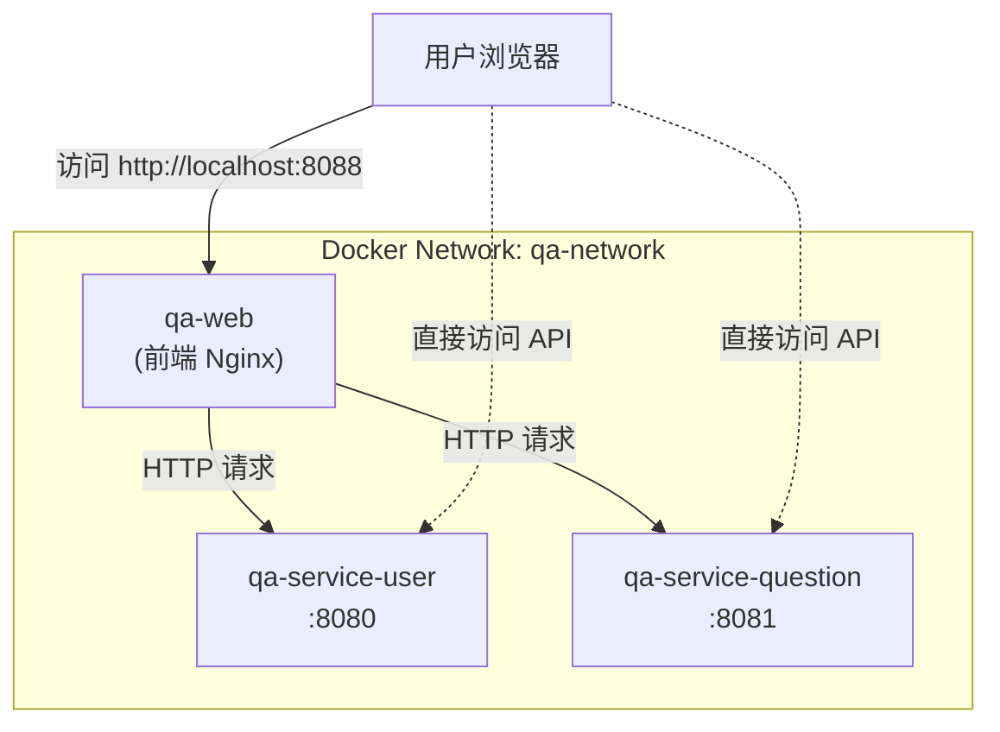
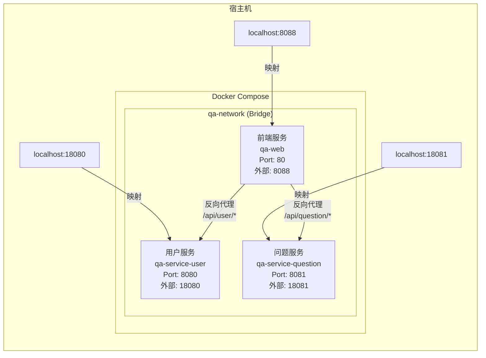
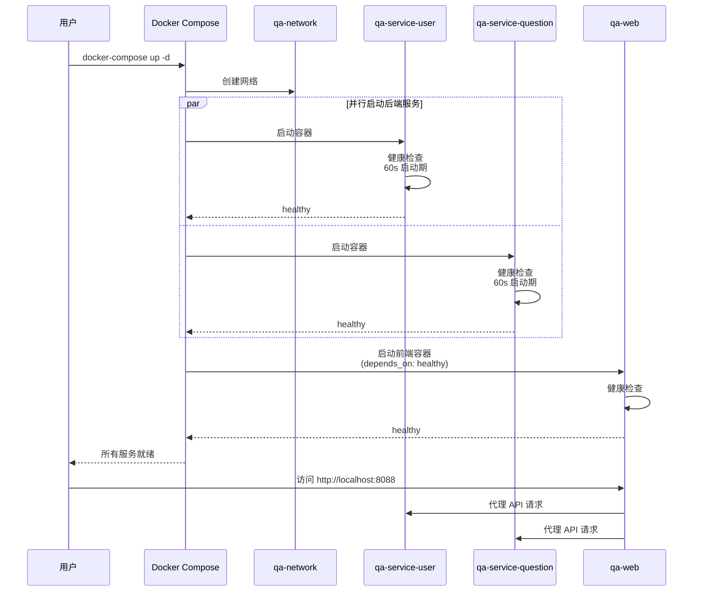

# 后端项目部署文档

## 1. 部署概述

本文档描述后端服务的部署方式，支持以下部署模式：

| 部署模式 | 适用场景 | 复杂度 |
|----------|----------|--------|
| **本地开发部署** | 开发调试 | ⭐ |
| **Docker 单机部署** | 测试环境、小规模生产 | ⭐⭐ |
| **Docker Compose 部署** | 完整环境一键部署 | ⭐⭐ |
| **Kubernetes 部署** | 大规模生产环境 | ⭐⭐⭐⭐ |

---

## 2. 服务架构

### 2.1 微服务清单

| 服务名 | 服务代码 | 内部端口 | 外部端口 | 说明 |
|--------|----------|----------|----------|------|
| 用户服务 | qa-service-user | 8080 | 18080 | 用户管理、认证授权 |
| 问题服务 | qa-service-question | 8081 | 18081 | 问题管理、问答流程 |
| 统计服务 | qa-service-statistic | 8082 | - | 数据统计（待开发） |

### 2.2 服务依赖关系



### 2.3 Docker Compose 部署架构



### 2.4 容器启动顺序与时序



---

## 3. Docker 部署

### 3.1 Dockerfile 说明

#### 用户服务 Dockerfile

```dockerfile
# 多阶段构建 - 构建阶段
FROM maven:3.9-eclipse-temurin-17 AS builder
WORKDIR /app

# 先复制 pom.xml 下载依赖（利用缓存层）
COPY pom.xml .
RUN mvn dependency:go-offline -B

# 复制源码并构建
COPY src ./src
RUN mvn clean package -DskipTests

# 多阶段构建 - 运行阶段
FROM eclipse-temurin:17-jre

# 安装 curl 用于健康检查
RUN apt-get update && apt-get install -y curl && rm -rf /var/lib/apt/lists/*

WORKDIR /app

# 复制构建产物
COPY --from=builder /app/target/*.jar app.jar

EXPOSE 8080

# 健康检查
HEALTHCHECK --interval=30s --timeout=3s --start-period=60s --retries=3 \
  CMD curl -f http://localhost:8080/actuator/health || exit 1

ENTRYPOINT ["java", "-jar", "app.jar"]
```

**构建优化点：**
- **多阶段构建**：分离构建环境和运行环境，减小镜像体积
- **依赖缓存**：先复制 `pom.xml` 下载依赖，源码变更时无需重复下载
- **精简 JRE**：使用 `eclipse-temurin:17-jre` 而非完整 JDK
- **健康检查**：内置 Actuator 健康检查端点

### 3.2 镜像构建

```bash
# 构建用户服务镜像
cd qa-service-user
docker build -t qa-service-user:latest .

# 构建问题服务镜像
cd qa-service-question
docker build -t qa-service-question:latest .

# 查看构建结果
docker images | grep qa-service
```

### 3.3 单机运行

```bash
# 运行用户服务
docker run -d \
  --name qa-service-user \
  -p 18080:8080 \
  -e SPRING_PROFILES_ACTIVE=prod \
  --network qa-network \
  qa-service-user:latest

# 运行问题服务
docker run -d \
  --name qa-service-question \
  -p 18081:8081 \
  -e SPRING_PROFILES_ACTIVE=prod \
  -e SERVER_PORT=8081 \
  --network qa-network \
  qa-service-question:latest
```

---

## 4. Docker Compose 部署

### 4.1 完整部署（推荐）

```bash
# 在项目根目录执行
cd /Users/nebula/repo/ai-training/homework-320/qa-live-healthcare

# 启动所有服务
docker-compose up -d

# 查看服务状态
docker-compose ps

# 查看日志
docker-compose logs -f

# 停止服务
docker-compose down

# 停止并删除数据卷
docker-compose down -v
```

### 4.2 docker-compose.yml 详解

```yaml
services:
  # 用户服务
  qa-service-user:
    build:
      context: ./server/qa-service-user
      dockerfile: Dockerfile
    container_name: qa-service-user
    ports:
      - "18080:8080"                    # 外部端口:内部端口
    environment:
      - SPRING_PROFILES_ACTIVE=prod      # 生产环境配置
      - SERVER_PORT=8080
    networks:
      - qa-network                       # 自定义网络
    restart: unless-stopped              # 自动重启策略
    healthcheck:                         # 健康检查
      test: ["CMD", "curl", "-f", "http://localhost:8080/actuator/health"]
      interval: 30s
      timeout: 10s
      retries: 3
      start_period: 60s

  # 问题服务
  qa-service-question:
    build:
      context: ./server/qa-service-question
      dockerfile: Dockerfile
    container_name: qa-service-question
    ports:
      - "18081:8081"
    environment:
      - SPRING_PROFILES_ACTIVE=prod
      - SERVER_PORT=8081
    networks:
      - qa-network
    restart: unless-stopped
    healthcheck:
      test: ["CMD-SHELL", "curl -s -o /dev/null -w '%{http_code}' http://localhost:8081/ | grep -E '404|200'"]
      interval: 30s
      timeout: 10s
      retries: 3
      start_period: 60s

networks:
  qa-network:
    driver: bridge
```

**关键配置说明：**

| 配置项 | 说明 |
|--------|------|
| `ports` | 端口映射，外部访问使用 |
| `environment` | 环境变量，覆盖配置文件 |
| `networks` | 自定义网络，服务间通信 |
| `restart` | 重启策略：`no`/`always`/`unless-stopped`/`on-failure` |
| `healthcheck` | 健康检查，确保服务可用 |

### 4.3 服务启动顺序

```
启动流程:
━━━━━━━━━━━━━━━━━━━━━━━━━━━━━━━━━━━━━━━━━━━━━━━━━━━━━━━━━━━━━━━━

1. 创建网络 qa-network
   └── docker network create qa-network

2. 启动 qa-service-user
   ├── 构建镜像（首次）
   ├── 启动容器
   ├── 执行健康检查（60秒启动期）
   └── 状态: healthy

3. 启动 qa-service-question
   ├── 构建镜像（首次）
   ├── 启动容器
   ├── 执行健康检查
   └── 状态: healthy

4. 服务就绪，可接受请求
   └── 访问: http://localhost:18080/actuator/health
```

---

## 5. 环境配置

### 5.1 配置文件

```
qa-service-user/src/main/resources/
├── application.yml              # 默认配置
├── application-dev.yml          # 开发环境
├── application-test.yml         # 测试环境
└── application-prod.yml         # 生产环境（Docker 使用）
```

### 5.2 Docker 环境变量

| 变量名 | 默认值 | 说明 |
|--------|--------|------|
| `SPRING_PROFILES_ACTIVE` | `default` | 激活的配置文件 |
| `SERVER_PORT` | `8080` | 服务端口 |
| `LOG_LEVEL` | `INFO` | 日志级别 |

### 5.3 自定义配置

```bash
# 使用自定义配置文件
docker run -d \
  -v /host/path/application-custom.yml:/app/application-custom.yml \
  -e SPRING_PROFILES_ACTIVE=custom \
  qa-service-user:latest

# 使用环境变量覆盖配置
docker run -d \
  -e SERVER_PORT=9090 \
  -e LOGGING_LEVEL_ROOT=DEBUG \
  qa-service-user:latest
```

---

## 6. 健康检查与监控

### 6.1 Actuator 端点

| 端点 | 说明 | 访问方式 |
|------|------|----------|
| `/actuator/health` | 健康检查 | http://localhost:18080/actuator/health |
| `/actuator/info` | 应用信息 | http://localhost:18080/actuator/info |
| `/actuator/metrics` | 指标数据 | http://localhost:18080/actuator/metrics |
| `/actuator/env` | 环境变量 | http://localhost:18080/actuator/env |

### 6.2 健康检查响应

```bash
# 检查用户服务健康状态
curl http://localhost:18080/actuator/health

# 响应示例
{
  "status": "UP",
  "components": {
    "diskSpace": {
      "status": "UP",
      "details": {
        "total": 499963174912,
        "free": 123456789012
      }
    },
    "ping": {
      "status": "UP"
    }
  }
}
```

### 6.3 容器健康状态

```bash
# 查看容器健康状态
docker ps

# 输出示例
CONTAINER ID   STATUS                   PORTS
abc123         Up 5 minutes (healthy)   0.0.0.0:18080->8080/tcp
```

---

## 7. 日志管理

### 7.1 查看日志

```bash
# 查看实时日志
docker logs -f qa-service-user

# 查看最近 100 行
docker logs --tail 100 qa-service-user

# 查看包含特定关键字的日志
docker logs qa-service-user 2>&1 | grep ERROR

# 查看特定时间段的日志
docker logs --since 2025-03-21T10:00:00 qa-service-user
```

### 7.2 日志持久化

```yaml
# docker-compose.yml 添加卷映射
services:
  qa-service-user:
    volumes:
      - ./logs/user:/app/logs  # 持久化日志到宿主机
```

### 7.3 日志轮转

```bash
# 使用 Docker 日志驱动限制日志大小
docker run -d \
  --log-driver json-file \
  --log-opt max-size=10m \
  --log-opt max-file=3 \
  qa-service-user:latest
```

---

## 8. 性能调优

### 8.1 JVM 参数配置

```dockerfile
# Dockerfile 中设置 JVM 参数
ENTRYPOINT ["java", \
  "-Xms512m", \
  "-Xmx1024m", \
  "-XX:+UseG1GC", \
  "-XX:MaxGCPauseMillis=200", \
  "-jar", "app.jar"]
```

### 8.2 容器资源限制

```yaml
# docker-compose.yml
services:
  qa-service-user:
    deploy:
      resources:
        limits:
          cpus: '1.0'
          memory: 1G
        reservations:
          cpus: '0.5'
          memory: 512M
```

---

## 9. 故障排查

### 9.1 常见问题

| 问题 | 原因 | 解决方案 |
|------|------|----------|
| 容器启动失败 | 端口冲突 | 修改端口映射 |
| 健康检查失败 | 启动时间过长 | 调整 `start_period` |
| 内存不足 | JVM 堆内存过大 | 调整 `-Xmx` 参数 |
| 网络不通 | 未加入同一网络 | 检查 `networks` 配置 |

### 9.2 排查命令

```bash
# 查看容器详情
docker inspect qa-service-user

# 进入容器内部
docker exec -it qa-service-user /bin/bash

# 查看容器资源使用
docker stats qa-service-user

# 查看容器事件
docker events --filter container=qa-service-user
```

---

## 10. 生产环境建议

### 10.1 安全加固

```yaml
# docker-compose.yml 安全配置
services:
  qa-service-user:
    read_only: true                    # 只读根文件系统
    user: "1000:1000"                  # 非 root 用户运行
    security_opt:
      - no-new-privileges:true         # 禁止提权
    cap_drop:
      - ALL                            # 丢弃所有权限
    cap_add:
      - NET_BIND_SERVICE               # 仅保留必要权限
```

### 10.2 高可用部署

```yaml
# 使用 Docker Swarm 或 Kubernetes 实现高可用
services:
  qa-service-user:
    deploy:
      replicas: 3                      # 3 个实例
      update_config:
        parallelism: 1                 # 每次更新 1 个
        delay: 10s                     # 延迟 10 秒
      restart_policy:
        condition: on-failure          # 失败时重启
```

---

## 11. 附录

### 11.1 常用命令速查

```bash
# 构建
docker build -t qa-service-user:latest ./qa-service-user

# 运行
docker run -d -p 18080:8080 --name qa-service-user qa-service-user:latest

# 停止
docker stop qa-service-user

# 删除
docker rm qa-service-user

# 查看日志
docker logs -f qa-service-user

# 进入容器
docker exec -it qa-service-user /bin/bash
```

### 11.2 端口对照表

| 服务 | 容器内部端口 | 宿主机映射端口 | 访问地址 |
|------|-------------|---------------|----------|
| 用户服务 | 8080 | 18080 | http://localhost:18080 |
| 问题服务 | 8081 | 18081 | http://localhost:18081 |

### 11.3 参考文档

- [Docker 官方文档](https://docs.docker.com/)
- [Docker Compose 官方文档](https://docs.docker.com/compose/)
- [Spring Boot Docker 部署](https://spring.io/guides/topicals/spring-boot-docker/)
