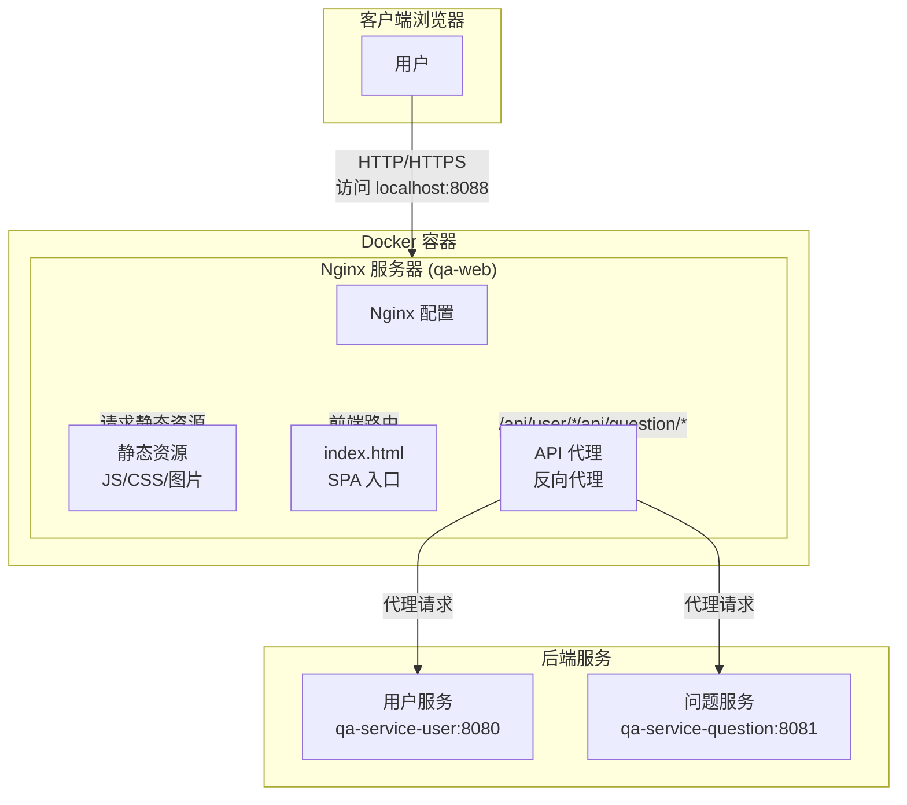
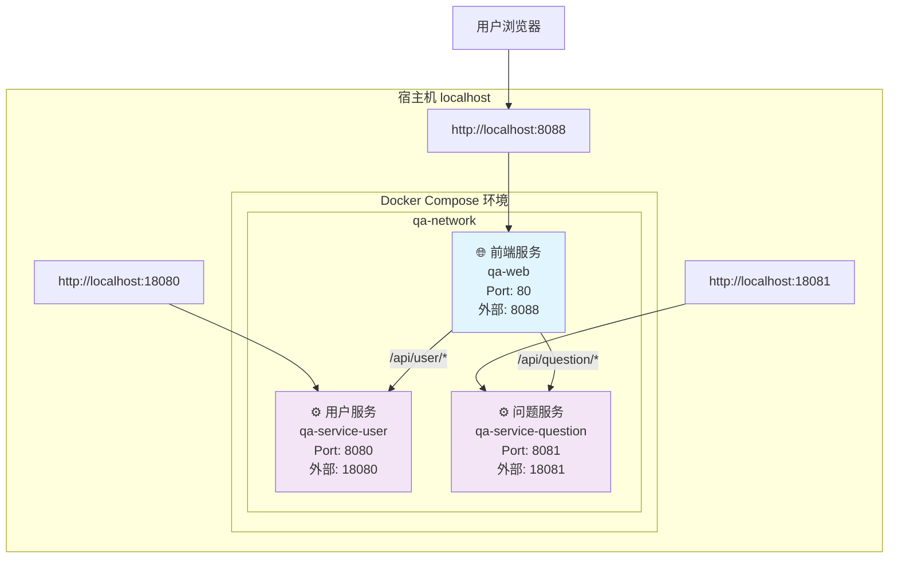
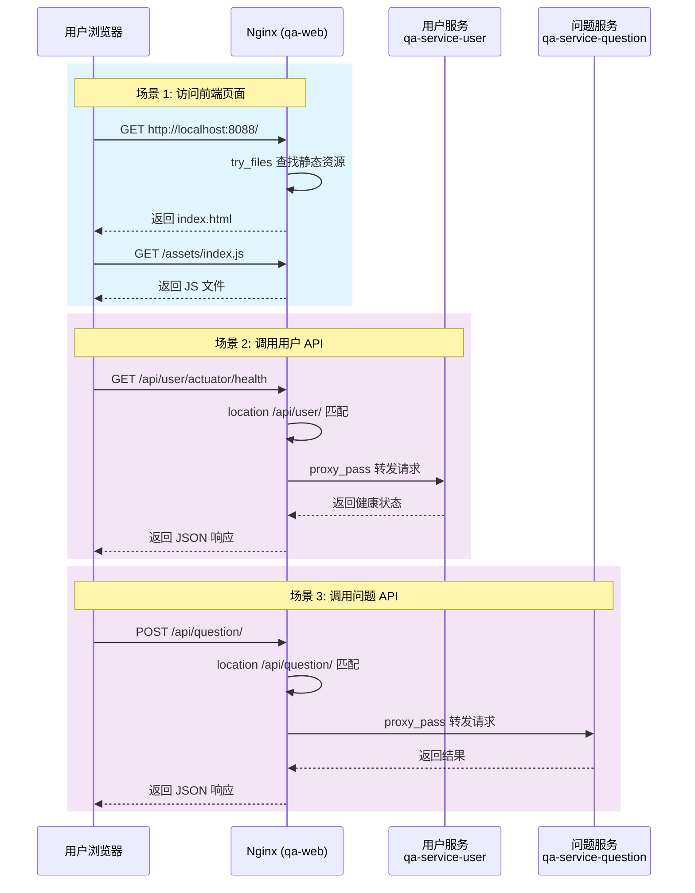

# 前端项目部署文档

## 1. 部署概述

本文档描述前端应用的部署方式，支持以下部署模式：

| 部署模式 | 适用场景 | 复杂度 |
|----------|----------|--------|
| **本地开发部署** | 开发调试 | ⭐ |
| **静态文件部署** | 简单部署到 Web 服务器 | ⭐ |
| **Docker 部署** | 容器化部署，环境一致 | ⭐⭐ |
| **Docker Compose 全栈部署** | 前后端一体化部署 | ⭐⭐ |
| **CDN 部署** | 生产环境高性能部署 | ⭐⭐⭐ |

---

## 2. 架构说明

### 2.1 前端部署架构



### 2.2 Docker Compose 全栈部署架构



### 2.3 请求流向图



### 2.2 反向代理配置

前端 Nginx 作为统一入口，将 API 请求反向代理到后端服务：

| 前端路径 | 代理目标 | 后端服务 |
|----------|----------|----------|
| `/api/user/*` | `http://qa-service-user:8080/*` | 用户服务 |
| `/api/question/*` | `http://qa-service-question:8081/*` | 问题服务 |

---

## 3. 构建部署

### 3.1 本地构建

```bash
# 进入前端项目目录
cd web/qa-web

# 安装依赖
npm install

# 开发模式启动
npm run dev

# 生产构建
npm run build

# 构建输出目录: dist/
```

### 3.2 构建产物

```
dist/                           # 构建输出目录
├── assets/                     # 静态资源
│   ├── index-xxx.js           # JS 文件（含 hash）
│   ├── index-xxx.css          # CSS 文件（含 hash）
│   └── ...
├── index.html                  # 入口 HTML
└── ...
```

---

## 4. Docker 部署

### 4.1 Dockerfile 说明

```dockerfile
# 多阶段构建 - 构建阶段
FROM node:22-alpine AS builder
WORKDIR /app

# 复制 package.json 并安装依赖
COPY package.json ./
RUN npm install

# 复制源代码并构建
COPY . .
RUN npm run build

# 多阶段构建 - 运行阶段
FROM nginx:alpine

# 复制构建产物到 Nginx 目录
COPY --from=builder /app/dist /usr/share/nginx/html

# 复制自定义 Nginx 配置
COPY nginx.conf /etc/nginx/conf.d/default.conf

EXPOSE 80

# 健康检查
HEALTHCHECK --interval=30s --timeout=3s --start-period=10s --retries=3 \
  CMD wget --no-verbose --tries=1 --spider http://localhost/ || exit 1

CMD ["nginx", "-g", "daemon off;"]
```

**构建优化点：**
- **多阶段构建**：构建环境和运行环境分离
- **精简基础镜像**：使用 `nginx:alpine` 减小体积
- **缓存优化**：先复制 `package.json` 安装依赖
- **健康检查**：确保服务可用

### 4.2 Nginx 配置

```nginx
server {
    listen 80;
    server_name localhost;
    root /usr/share/nginx/html;
    index index.html;

    # Gzip 压缩
    gzip on;
    gzip_vary on;
    gzip_min_length 1024;
    gzip_types text/plain text/css text/xml text/javascript 
               application/javascript application/xml+rss application/json;

    # 缓存静态资源（1年）
    location ~* \.(js|css|png|jpg|jpeg|gif|ico|svg|woff|woff2|ttf|eot)$ {
        expires 1y;
        add_header Cache-Control "public, immutable";
    }

    # 前端路由支持 - SPA 应用所有路径指向 index.html
    location / {
        try_files $uri $uri/ /index.html;
    }

    # 反向代理到后端服务 - 用户服务
    location /api/user/ {
        proxy_pass http://qa-service-user:8080/;
        proxy_http_version 1.1;
        proxy_set_header Host $host;
        proxy_set_header X-Real-IP $remote_addr;
        proxy_set_header X-Forwarded-For $proxy_add_x_forwarded_for;
        proxy_set_header X-Forwarded-Proto $scheme;
    }

    # 反向代理到后端服务 - 问题服务
    location /api/question/ {
        proxy_pass http://qa-service-question:8081/;
        proxy_http_version 1.1;
        proxy_set_header Host $host;
        proxy_set_header X-Real-IP $remote_addr;
        proxy_set_header X-Forwarded-For $proxy_add_x_forwarded_for;
        proxy_set_header X-Forwarded-Proto $scheme;
    }

    # 错误页面
    error_page 500 502 503 504 /50x.html;
    location = /50x.html {
        root /usr/share/nginx/html;
    }
}
```

**关键配置说明：**

| 配置项 | 说明 |
|--------|------|
| `try_files $uri $uri/ /index.html` | SPA 路由支持，所有路径返回 index.html |
| `gzip` | 启用 Gzip 压缩，减少传输大小 |
| `expires 1y` | 静态资源缓存 1 年 |
| `proxy_pass` | 反向代理到后端服务 |

### 4.3 镜像构建

```bash
# 构建前端镜像
cd web/qa-web
docker build -t qa-web:latest .

# 查看镜像
docker images qa-web

# 运行容器
docker run -d \
  --name qa-web \
  -p 8088:80 \
  --network qa-network \
  qa-web:latest
```

### 4.4 访问应用

```bash
# 浏览器访问
http://localhost:8088

# 测试健康检查
curl http://localhost:8088
```

---

## 5. Docker Compose 部署

### 5.1 全栈部署

```bash
# 在项目根目录执行
cd /Users/nebula/repo/ai-training/homework-320/qa-live-healthcare

# 启动所有服务（包含前后端）
docker-compose up -d

# 查看服务状态
docker-compose ps

# 查看前端日志
docker-compose logs -f qa-web

# 停止所有服务
docker-compose down
```

### 5.2 docker-compose.yml 前端配置

```yaml
services:
  # 前端服务
  qa-web:
    build:
      context: ./web/qa-web
      dockerfile: Dockerfile
    container_name: qa-web
    ports:
      - "8088:80"                       # 外部访问端口
    depends_on:
      qa-service-user:
        condition: service_healthy      # 等待用户服务健康
      qa-service-question:
        condition: service_healthy      # 等待问题服务健康
    networks:
      - qa-network
    restart: unless-stopped
    healthcheck:
      test: ["CMD", "wget", "--no-verbose", "--tries=1", "--spider", "http://localhost/"]
      interval: 30s
      timeout: 10s
      retries: 3
      start_period: 10s
```

**依赖关系说明：**
- `depends_on` 确保后端服务先启动
- `condition: service_healthy` 等待后端服务健康检查通过
- 前端作为入口，聚合所有后端服务

### 5.3 服务启动顺序

```
启动流程:
━━━━━━━━━━━━━━━━━━━━━━━━━━━━━━━━━━━━━━━━━━━━━━━━━━━━━━━━━━━━━━━━

1. 创建网络 qa-network

2. 启动后端服务
   ├── qa-service-user (健康检查)
   └── qa-service-question (健康检查)

3. 启动前端服务
   ├── 构建前端镜像
   ├── 启动 Nginx 容器
   └── 健康检查

4. 服务就绪
   └── 访问: http://localhost:8088

访问路径:
• 前端页面: http://localhost:8088/
• 用户 API: http://localhost:8088/api/user/
• 问题 API: http://localhost:8088/api/question/
```

---

## 6. 环境配置

### 6.1 环境变量

前端构建时支持环境变量配置：

```bash
# .env 文件
VITE_API_BASE_URL=/api
VITE_APP_TITLE=在线问诊平台
VITE_APP_VERSION=1.0.0
```

### 6.2 多环境构建

```bash
# 开发环境
npm run build:dev

# 测试环境
npm run build:test

# 生产环境
npm run build:prod
```

### 6.3 Docker 环境传递

```dockerfile
# Dockerfile
ARG VITE_API_BASE_URL
ENV VITE_API_BASE_URL=$VITE_API_BASE_URL

RUN npm run build
```

```bash
# 构建时传递参数
docker build \
  --build-arg VITE_API_BASE_URL=/api \
  -t qa-web:latest .
```

---

## 7. 生产环境部署

### 7.1 Nginx 性能优化

```nginx
server {
    listen 80;
    server_name qa.example.com;
    
    # 开启高效文件传输
    sendfile on;
    tcp_nopush on;
    tcp_nodelay on;
    
    # 连接保持
    keepalive_timeout 65;
    
    # Gzip 压缩
    gzip on;
    gzip_vary on;
    gzip_proxied any;
    gzip_comp_level 6;
    gzip_types text/plain text/css text/xml application/json 
               application/javascript application/rss+xml 
               application/atom+xml image/svg+xml;
    
    # 客户端缓存
    location ~* \.(js|css|png|jpg|jpeg|gif|ico|svg)$ {
        expires 1y;
        add_header Cache-Control "public, immutable";
        add_header Vary Accept-Encoding;
    }
    
    # HTML 不缓存
    location ~* \.html$ {
        expires -1;
        add_header Cache-Control "no-store, no-cache, must-revalidate";
    }
    
    # SPA 路由
    location / {
        try_files $uri $uri/ /index.html;
    }
    
    # API 代理
    location /api/ {
        proxy_pass http://backend-server/;
        proxy_http_version 1.1;
        proxy_set_header Connection "";
        proxy_set_header Host $host;
        proxy_set_header X-Real-IP $remote_addr;
    }
}
```

### 7.2 HTTPS 配置

```nginx
server {
    listen 443 ssl http2;
    server_name qa.example.com;
    
    # SSL 证书
    ssl_certificate /etc/nginx/ssl/cert.pem;
    ssl_certificate_key /etc/nginx/ssl/key.pem;
    
    # SSL 优化
    ssl_session_cache shared:SSL:10m;
    ssl_session_timeout 10m;
    ssl_protocols TLSv1.2 TLSv1.3;
    ssl_ciphers ECDHE-ECDSA-AES128-GCM-SHA256:ECDHE-RSA-AES128-GCM-SHA256;
    ssl_prefer_server_ciphers on;
    
    # HSTS
    add_header Strict-Transport-Security "max-age=31536000" always;
    
    # 其他配置...
}

# HTTP 重定向到 HTTPS
server {
    listen 80;
    server_name qa.example.com;
    return 301 https://$server_name$request_uri;
}
```

### 7.3 CDN 部署

```
CDN 加速架构:
━━━━━━━━━━━━━━━━━━━━━━━━━━━━━━━━━━━━━━━━━━━━━━━━━━━━━━━━━━━━━━━━

    用户请求
       │
       ▼
┌──────────────┐
│   CDN 节点    │  ← 静态资源缓存 (JS/CSS/图片)
│  (阿里云/腾讯) │
└──────┬───────┘
       │ 缓存未命中
       ▼
┌──────────────┐
│  Nginx 服务器 │  ← 源站服务器
│   (前端应用)  │
└──────────────┘

配置要点:
• 静态资源启用 CDN 加速
• HTML 文件不缓存（确保更新即时生效）
• API 请求直接到后端（不经过 CDN）
```

---

## 8. 健康检查与监控

### 8.1 Nginx 健康检查

```bash
# 测试前端服务
curl http://localhost:8088

# 预期响应: HTML 内容

# 测试静态资源
curl -I http://localhost:8088/assets/index.js

# 预期响应: 200 OK, 带缓存头
```

### 8.2 容器健康状态

```bash
# 查看容器健康状态
docker ps

# 输出示例
CONTAINER ID   STATUS                   PORTS
xyz789         Up 5 minutes (healthy)   0.0.0.0:8088->80/tcp
```

### 8.3 日志监控

```bash
# 查看 Nginx 访问日志
docker logs qa-web

# 查看错误日志
docker logs qa-web 2>&1 | grep error

# 实时日志
docker logs -f qa-web
```

---

## 9. 故障排查

### 9.1 常见问题

| 问题 | 原因 | 解决方案 |
|------|------|----------|
| 页面 404 | 路由配置错误 | 检查 `try_files` 配置 |
| 静态资源 404 | 构建产物缺失 | 检查 `dist/` 目录 |
| API 请求失败 | 反向代理配置错误 | 检查 `proxy_pass` |
| 样式错乱 | MIME 类型错误 | 检查 Nginx 配置 |
| 缓存不更新 | 浏览器缓存 | 清除缓存或加版本号 |

### 9.2 排查命令

```bash
# 查看容器内部文件
docker exec qa-web ls -la /usr/share/nginx/html

# 检查 Nginx 配置
docker exec qa-web nginx -t

# 查看 Nginx 配置
docker exec qa-web cat /etc/nginx/conf.d/default.conf

# 进入容器
docker exec -it qa-web /bin/sh

# 测试后端连通性
docker exec qa-web wget -qO- http://qa-service-user:8080/actuator/health
```

---

## 10. 附录

### 10.1 常用命令速查

```bash
# 构建镜像
docker build -t qa-web:latest .

# 运行容器
docker run -d -p 8088:80 --name qa-web qa-web:latest

# 停止容器
docker stop qa-web

# 删除容器
docker rm qa-web

# 查看日志
docker logs -f qa-web

# 进入容器
docker exec -it qa-web /bin/sh
```

### 10.2 端口对照表

| 服务 | 容器内部端口 | 宿主机映射端口 | 访问地址 |
|------|-------------|---------------|----------|
| 前端服务 | 80 | 8088 | http://localhost:8088 |

### 10.3 路径映射

| 前端路径 | 目标服务 | 说明 |
|----------|----------|------|
| `/` | 前端页面 | SPA 入口 |
| `/api/user/*` | qa-service-user:8080 | 用户服务代理 |
| `/api/question/*` | qa-service-question:8081 | 问题服务代理 |

### 10.4 参考文档

- [Vue 部署指南](https://vitejs.dev/guide/static-deploy.html)
- [Nginx 官方文档](https://nginx.org/en/docs/)
- [Docker 官方文档](https://docs.docker.com/)
